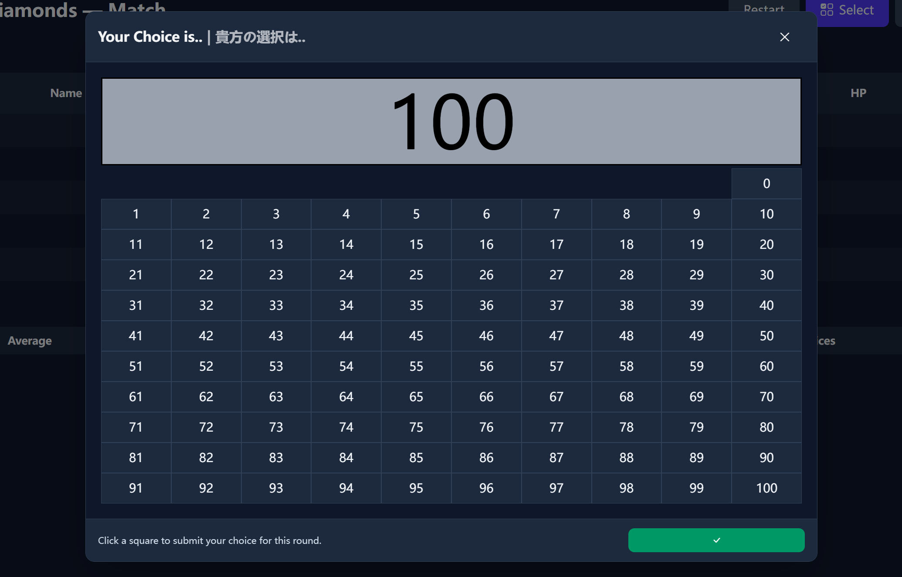

# ♦️King of Diamonds - ⚖️てんびんゲーム

A classic beauty-contest survival game inspired by the ***King of Diamonds* challenge** from *Alice in Borderland* (*今際の国のアリス*). With small twists (apply double dmg and same-diff rule to whole game instead of less than 3 players)and various bot player characteristics.



---

## 🎯 Game Introduction

In **King of Diamonds**, more than 3 players compete in rounds of number selection:

1. Each player secretly chooses an integer between **0 and 100**.
2. The system calculates:
```
Target = (Average of all chosen numbers) × 0.8
````
3. The player whose number is **closest to Target** is safe.  
All other players lose **1 HP**.
4. If all players choose the same number, **everyone loses HP**.
5. For a perfect hit, damage will be doubled.
6. If multiple players tie for closest, they are ignored and the next closest single winner is found.

**Last player standing wins**.

---

## 🧠 AI Personalities

The game features multiple AI strategies (precisely we call it algorithms), each with unique decision-making logic:

- **Human Player** — You, making manual choices via an interactive panel.
- **Absolute Rationalist** — Always picks exactly the calculated best guess (±1 random for human-like calc error).
- **Swinging Rationalist** — Picks near the best guess with a small random offset. Gets more upset when Hp goes low.
- **Troublemaker** — Picks extreme low/high random values to disrupt.
- **Quitter** — Plays rationally early, goes random when low HP.
- **Gambler** — Goes random at full HP, rational when in danger.
- **Copycat** — Always copies last round’s winner.
- **Smoother** — Predicts trend of averages before calculating.
- **Mathametician** — Try to predict multiple steps to mimic the 'my perfect equation'.
- **Kuzuryu** — Plays with “perfect information” to maximize win chance. Mimicking how the boss performs.

---

## 💡 Inspirations

- **《今際の国のアリス》** (*Alice in Borderland*), Season 2, *King of Diamonds* game
---

## 🛠 Tech Stack

- **Frontend Framework**: [Preact](https://preactjs.com/) + [TypeScript](https://www.typescriptlang.org/)
- **Bundler**: [Vite](https://vitejs.dev/)
- **Styling**: [Tailwind CSS](https://tailwindcss.com/)
- **Icons Lib**: [Bootstrap Icons](https://icons.getbootstrap.com/)
- **Name Generation**: [unique-names-generator](https://github.com/andreasonny83/unique-names-generator)

---

## 🚀 How to Run Locally

### 1. Clone the repository
```bash
git clone https://github.com/Hanny658/King-of-Diamonds.git
cd King-of-Diamonds
````

### 2. Install dependencies

```bash
npm install
```

### 3. Start development server

```bash
npm run dev
```

Then open `http://localhost:5173` in your browser.

### 4. Build for production

```bash
npm run build
```
This will build static files into dist/, then you can test with serve.

---

## 🌐 Play Online

You can try the game here:
🔗 **[My Minigame](https://minigame.hanny.vip)**

---

## 📜 License

Apache-2.0 License © 2025 Hanny Zhang
